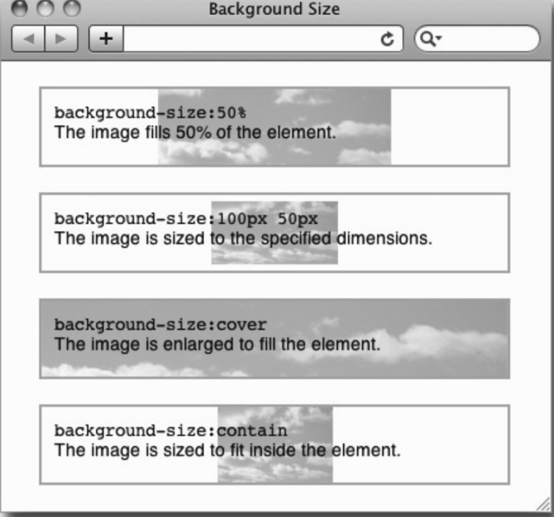

# 定位元素
 **所谓盒模型，就是浏览器为页面中的每个HTML元素生成的矩形盒子。这些盒子们都要按照可见版式模型(visual formatting model)在页面上排布。可见的页面版式主要由三个属性控制:position 属性、display属性和float属性。其中，position 属性控制页面上元素间的位置关系，display属性控制元素是堆叠、并排，还是根本不在页面上出现，float属性提供控制的方式，以便把元素组成成多栏布局。**
 
 + 重置css样式：[https://meyerweb.com/eric/tools/css/reset/](https://meyerweb.com/eric/tools/css/reset/)
 + 外边距叠加（后边详细研究）
 + 外边距的单位(一般用em，这样当字体被放大时，段落间距随之变大)
    ``` 
    根据经验，为文本元素设置外边距时通常需要混合使用不同的单位。比如说，一个段落的左、右外边距可以使用像素，以便该段文本始终与包含元素边界保持固定间距，不受字号变大或变小的影响。而对于上、下外边距，以em为单位则可以让段间距随字号变化而相应增大或缩小，比如:
    这里使用了简写属性把上、下外边距设置为.75em，把左、右外边距设置为30像素 
    p {font-size:1em; margin:.75em 30px;}
    这样，段落的垂直间距始终会保持为字体高度的四分之三(上下外边距都是.75em， 叠加后还是.75em)。如果用户增大了字号，那么不仅段落中的文本会变大，段间距也会成比例变大。这样，页面的整体布局就会比较协调一致。与此同时，使用像素单位的左、右外边距不会改变。我想，你应该也不会想让字号变化影响到布局宽度吧。
    ```

+ ##清除浮动的三种方式 （css揭秘-93）
    1. 为父元素添加 overflow:hidden 
    2. 同时浮动父元素 float:left; width:100%;
    3. 在 HTML 标记中添加一个子元素，并给它应用 clear 属性 {clear:left;}
    4. 给父元素添加一个类 
            `.clearfix:after {
                       content:".";
                       display:block;
                       height:0;
                       visibility:hidden;
                       clear:both;
            }`
    5. 没有父元素时如何清除 （css揭秘-96）

+ ##定位 position
    + 静态定位: static(默认值)
    + 相对定位: relative 相对的是它原来在文档流中的位置(或者默认位置)
      `除了这个元素自己相对于原始位置挪动了一下之外，页面没有发生任何变化。换句话说，这个元素原来占据的空间没有动，其他元素也没动。`
    + 绝对定位: absolute 绝对定位跟静态定位和相对定位比，绝对不一样。因为绝对定位会把元素彻底从文档流中拿出来（==元素之前占据的空间被“回收了”==）
    + 固定定位: fixed 从完全移出文档流的角度说，固定定位与绝对定位类似。但不同之处在于，固定定位元素的定位上下文是视口(浏览器窗口或手持设备的屏幕)，因此它不会随页面滚动而移动

        `定位上下文: （仅针对绝对定位）
        把元素的 position 属性设定为 relative、absolute 或 fixed后，继而可以使用top、right、bottom 和 left 属性，相对于另一个元素移动该元素的位置。这里的“另一个元素”，就是该元素的定位上下文。在讲绝对定位的时候，我们知道绝对定位元素默认的定位上下文是body。这是因为body是标记中所有元素唯一的祖先元素。而实际上，绝对定位元素的任何祖先元素都可以成为它的定位上下文，只要你把相应祖先元素的position设定为 relative 即可.`
    ==普通元素的百分比宽度是相对于父元素的content-box宽度计算的，而绝对定位元素的宽度是相对于第一个position不等于static的祖先元素计算的 《css世界》p-178==
    
+ ##背景
    + background-color
    + background-image
    + background-repeat
        + repeat-x：背景图像在横向上平铺(会被截断)
        + repeat-y：背景图像在纵向上平铺(会被截断)
        + repeat：背景图像在横向和纵向平铺 (会被截断)
        + no-repeat：背景图像不平铺
        + round：为确保图片不被剪切,背景图像自动缩放直到适应且填充满整个容器。（CSS3）
        + space：为确保图片不被剪切,背景图像以相同的间距平铺且填充满整个容器或某个方向。（CSS3）
            `允许提供2个参数，如果提供全部2个参数，第1个用于横向，第二个用于纵向。如果只提供1个参数，则用于横向和纵向。特殊值repeat-x和repeat-y除外，因为repeat-x相当于repeat no-repeat，repeat-y相当于no-repeat repeat，即其实repeat-x和repeat-y等价于提供了2个参数值`
    + background-position
        + 百分比值：第一个值是水平位置，第二个值是垂直位置。左上角是0％0％。右下角是100％100％。如果仅指定了一个值，其他值将是50％。默认值为：0％0％
        + 关键字（ top、left、bottom、right 和 center）
        + 像素值
        + inherit: 指定background-position属性设置应该从父元素继承
            `设定背景位置时可以使用三种值:关键字、百分比、绝对或相对单位的数值。可以使用两个值分别设定水平和垂直位置。关键字指的顺序不重要，left bottom和bottom left意思相同。为了设定的值在所有浏览器中都有效，最好不要混用关键字值与数字值。
        使用数值(比如40% 30%)时，第一个值表示水平位置，第二个值表示垂直位置。要是只设定一个值，则将其用来设定水平位置，而垂直位置会被设为center。
        在使用关键字和百分比值的情况下，设定的值同时应用于元素和图片。换句话说，如果设定了33% 33%，则图片水平33%的位置与元素水平33%的位置对齐。垂直方面也一样图3-37所示也是一个例子，那是通过center center把图片的中心点定位在了元素的中心点。
        像素之类的绝对单位数值就不一样了。要是用像素单位来设定位置，那么图片的左上角会被放在距离元素左上角指定位置的地方。
        有意思的是，还可以使用负值。这样就可以把图片的左上角定位到元素外部，从而在元素中只能看到部分图片。当然，给图片设定足够大的正值，也可以把图片的右下角推到元素外部，从而在元素中也只能看到部分图片。位于元素外部的那部分图片不会显示`
    + background-size:控制背景图片的尺寸
        + 50%:缩放图片，使其填充背景区的一半
        + 100px 50px:把图片调整到100像素宽，50像素高。
        + cover:拉大图片，使其完全填满背景区;保持宽高比。 
        + contain:缩放图片，使其恰好适合背景区;保持宽高比。
        +   + DEMO 
    + background-attachment:控制滚动元素内的背景图片是否随元素滚动而移动
        + scroll 默认值 即背景图片随元素移动
        + fixed 背景图片不会随元素滚动而移动
    + background(简写属性)
    + background-clip: 控制背景绘制区域的范围，比如可以让背景颜色和背景图片只出现在内容区，而不出现在内边距区域。默认情况下，背景绘制区域是扩展到边框外边界的
    + background-origin: 指定background-position属性应该的相对位置
        + padding-box 相对于内边距左上角原点
        + border-box 相对于边框左上角外边界原点
        + content-box 相对于内容左上角原点
    + background-break:控制分离元素(比如跨越多行的行内盒子)的显示效果 (目前未见实例)
    + [background-blend-mode](https://developer.mozilla.org/zh-CN/docs/Web/CSS/background-blend-mode): 定义该元素的背景图片，以及背景色如何混合
    + 多背景图片 
    ```
    p{
    height:150px;
    width:348px;
    border:2px solid #aaa;
    margin:20px auto;
    font:24px/150px helvetica, arial, sansserif;
    text-align:center;
    background:
    url(images/turq_spiral.png) 30px -10px no-repeat,
    url(images/pink_spiral.png) 145px 0px no-repeat,
    url(images/gray_spiral.png) 140px -30px no-repeat, #ffbd75;
    }
    ```
    + 背景渐变
        + 线性渐变 linear-gradient
        + 径向渐变 radial-gradient
        
    